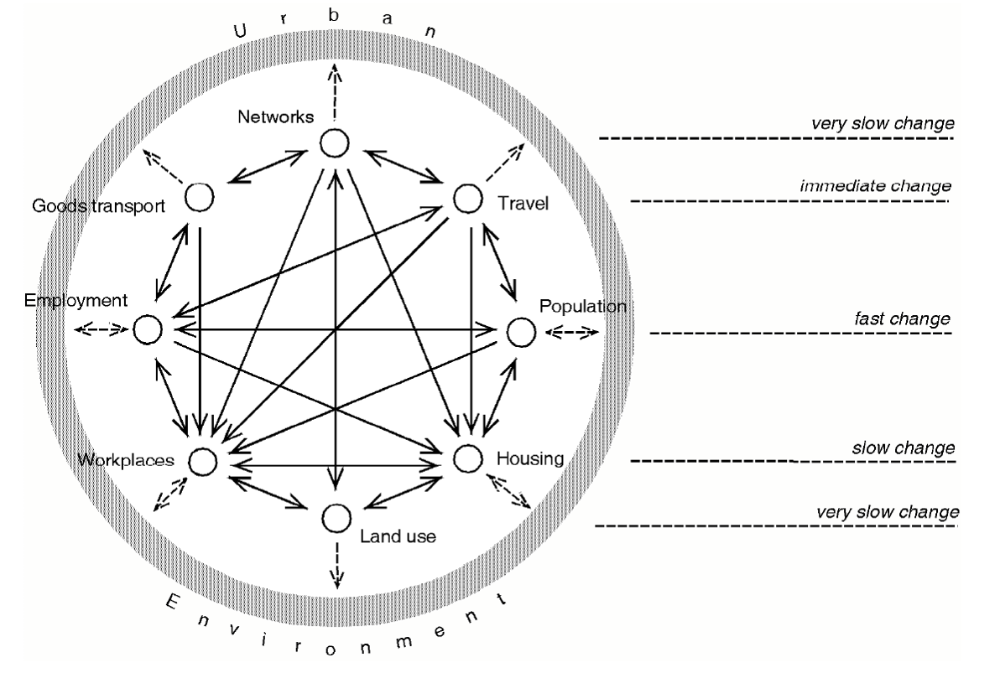
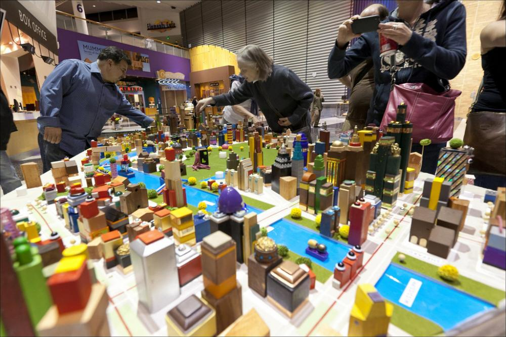
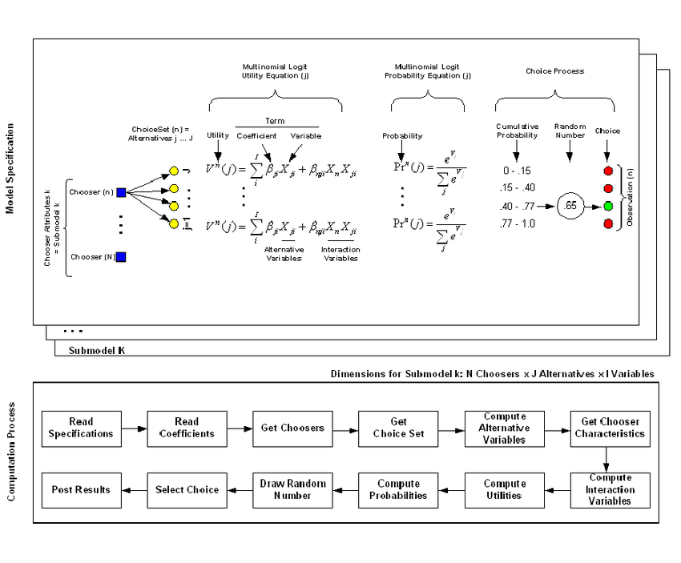
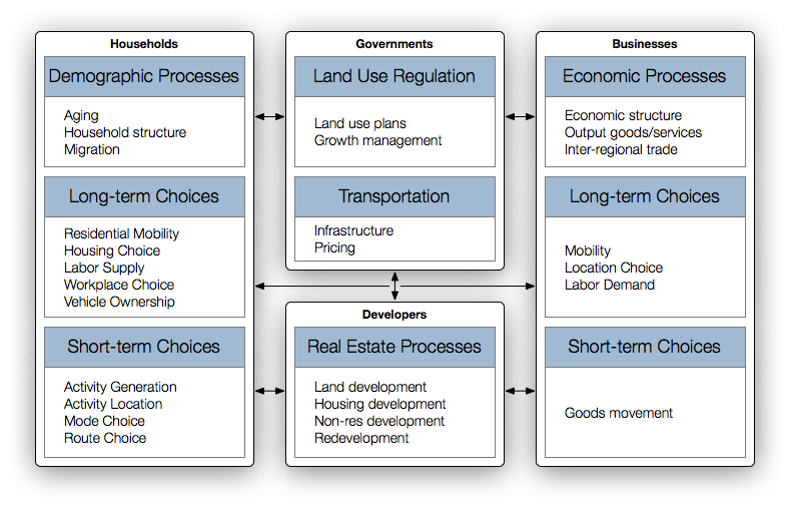
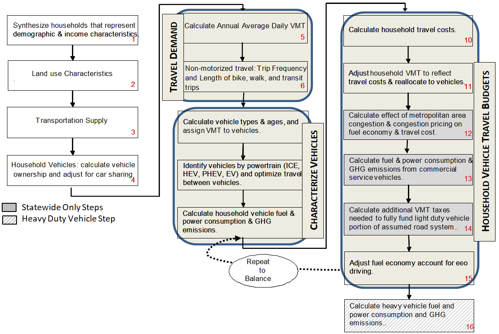
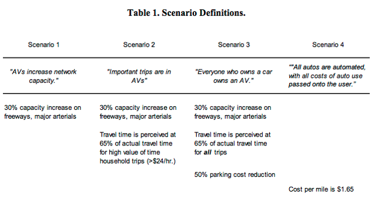
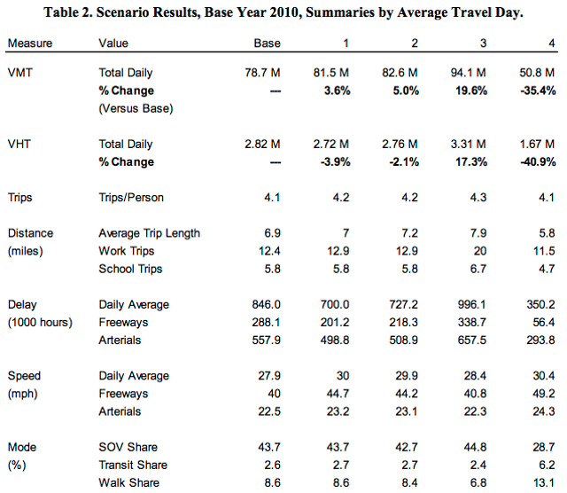
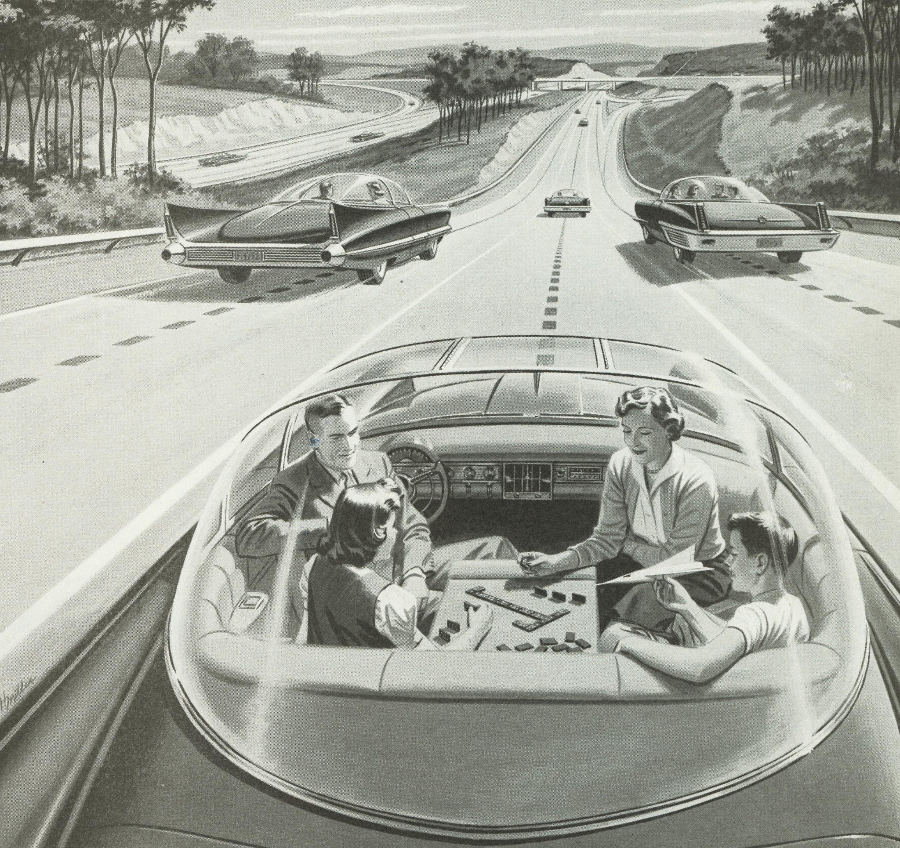
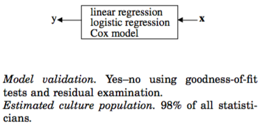
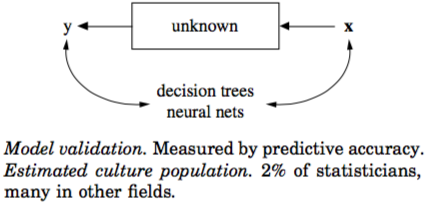

```{r setup, include=FALSE}
#knitr::opts_knit$set(root.dir = "../")
knitr::opts_chunk$set(message=FALSE, warning=F, echo=F, fig.align="center")
options(width = 2000)
options(repos="https://cran.rstudio.com")

require(tidyverse)
```

# Outline

- Computational Modeling in Transportation
      - Current practice
      - Applications
- Trends, Challenges and Opportunities
      - Transportation Technologies
      - Big Data
      - Machine Learning

---

# Computational Modeling in Transportation and Urban Planning

.pull-left[
### Computational modeling is useful in Transportation and Urban Planning because:
- Substantial public investment and polices that affects lives of thousands or millions;
- Public investment and polices are hard to reverse or irreversible
- The urban system is complex
]

.pull-right[

Credit: [Wegener, 1994](https://www.tandfonline.com/doi/abs/10.1080/01944369408975547) 
]

---

# Visioning vs Modeling

.pull-left[
- **Visioning** is a community oriented planning technique used to identify regional land-use and transportation goals
- **Objectives**: Consensus-building of the region's future
- **Tools**: Sketch planning tools (Envision Tomorrow+, CommunityViz, ...), paper/tablet maps, lego bricks
- Primarily driving by user-controlled inputs
- Limited by the quality of the public involvement and consensus-building, the feasibility of the preferred scenario
]

.pull-right[

Credit: [City of Milwaukie, OR](https://www.milwaukieoregon.gov/planning/visioning-place-it) 
]

---

# Visioning vs Modeling

.pull-left[
- **Urban Models** predict a region’s future traffic, spatial distribution of households and employment 
- **Objectives**: anticipating direct and indirect impacts of policies/planns/public investment
- **Tools**: Travel demand models, UrbanSim, DRAM/EPAL, MetroScope, CubeLand, ...
- Primarily driving by base year conditions, scenario inputs, and model assumptions
- Limited by the quality of inputs and model assumptions
]

.pull-right[

Source: [Waddell, 2005](https://www.researchgate.net/publication/228740459_Confronting_the_bane_of_endogeneity_in_modelling_urban_social_dynamics)
]

---

background-image: url("resources/LUM-evolution.png")
background-size: 80%
class: center, bottom

Evolution of Urban Models

---

# UrbanSim (1)


---

# UrbanSim (2)

- A model system for analyzing urban development
- Development started in late 1990s
- First developed in Java, later re-implemented with Python as an open source project (https://github.com/UDST/urbansim)
- Applications in dozens of regions in the US and many more around the globe

---

# Regional Strategic Planning Model (1)



---

# Regional Strategic Planning Model (2)

- A light-weighted modeling tool for transportation and land use policies visioning and evaluating
- Implmented in statstical programming language R
- GitHub Repository: https://github.com/gregorbj/VisionEval
- Applications in Oregon, Florida, Georgia

---

# Knowledge/Skills in Developing Models

```{r, out.width = "450px"}
knitr::include_graphics("resources/Data_Science_VD-Conway2013.png")
```

Credit: [Drew Conway](http://drewconway.com/zia/2013/3/26/the-data-science-venn-diagram)

---

background-image: url("resources/CRC.png")
background-size: 60%
class: center, bottom

Columbia River Crossing Study (Credit: Robert Liberty)

---

background-image: url("resources/CRC_VMT.png")
background-size: 72%
class: center, bottom

Columbia River Crossing Study with MetroScope (Source: [Sonny Conder, et al, 2010](http://www.oregonmetro.gov/sites/default/files/10272010_CRC_economic_impacts_tolling.pdf))

---

background-image: url("resources/CRC_density.png")
background-size: 72%
class: center, bottom

Columbia River Crossing Study with MetroScope (Source: [Sonny Conder, et al, 2010](http://www.oregonmetro.gov/sites/default/files/10272010_CRC_economic_impacts_tolling.pdf))

---

# Impact of Autonomous Vehicle Technology
- How adoption of Connected and Autonomous Vehicles affects traffic?
- How they affect travel behavior and travel demand?
- What are the requirement for the transportation and land use system (roadwork network, parking, etc)?
- Long term impact on land use?

---

# Impact of Autonomous Vehicle Technology

<center>
  
</center>

Source: [Childress, Nichols, Charlton, and Coe, 2015](https://psrc.github.io/attachments/2014/TRB-2015-Automated-Vehicles-Rev2.pdf) 

---

# Impact of Autonomous Vehicle Technology

<center>
  
</center>

Source: [Childress, Nichols, Charlton, and Coe, 2015](https://psrc.github.io/attachments/2014/TRB-2015-Automated-Vehicles-Rev2.pdf)

---
class: center, middle

# Trends, Challenges and Opportunities

---

# Transportation Technologies
<center>
  
</center>

[A 1950’s advertisement imagining an electric car of the future.Credit: Advertising Archive, via Everett Collection](https://www.nytimes.com/2018/03/31/opinion/distraction-self-driving-cars.html)

---

background-image: url("resources/Gruel2016.png")
background-size: 78%
class: bottom, left

A conceptual framework of AV’s effects. Source: [Gruel and Stanford (2016)](http://www.sciencedirect.com/science/article/pii/S2352146516300035)

---

# Big Data

.pull-left[
### Traditional Data Sources
- Census of Population and Employmnet
- Household and Travel Survey
- Traffic Counts
- ...
]

.pull-right[
### Big Data Sources
- Transit smart card data
- Cell phone signal
- Location-Based services
- Social media apps
- ...
]

---

# Machine Learning

.pull-left[


**Statistical models** ("the data modeling"): Assuming a data generation model and use data and hypothesis testing framework to recover parameters of the data generation process; the focus is more on $\boldsymbol{\hat{\beta}}$.
]

.pull-right[


**Machine learning** ("algorithmic modeling"): With no assumption of data generation process, use computer algorithms for pattern recognition and data-driven predictions-making; the focus is $\boldsymbol{\hat{Y}}$

]


